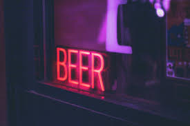

<html>
  <head>
    <meta name="description" content="beer ratings">
  </head>
  <body>
    <h1><u>Rating Light Beer in Hong Kong</u></h1>
    <h2><abbr title="Hypertext Martkup Language">A short discussion - why beer is so underrated</abbr></h2>
    
      
In this article, 10 beer brands commonly sold in convenience stores will be rated and discussed. Most are traditional brands with wonderful taste and texture, I will also discuss what ingredients makes the best beer, and which brand suits you accoording to your general beverage preferences. The history of beer in Hong Kong dates back to the mid-19th century, the era where beer reached peak popularity in Hong Kong. Yet nowadays, the popularity of beer have been declining, especially among newer generations. Why? Here are a couple of reasons:
      <ul>
        <li>introduction of new types of beverages in the market (e.g. canned cocktails)</li>
        <li>beer lacks wide range of flavours (e.g. Korean soju has 9 flavours)</li>
        <li>increased education enforcement on the cons of alcohol (as a result alcohol, especially the traditional ones, lack popularity among the younger generation... well... <em>until they get to clubs during college</em>)</li>
        <li>presence of brats who call beer 'bitter'</li>
      </ul>

    
At the end of the day, for whatever reason beer is lacking popularity, beer is still the best light alcohol beverage you would love to have after a long day. It's cheap, good texture, unique flavour, best experience when it comes with a little snack. It is also effective in putting you to sleep without getting you drunk. Moreover, <a href="https://www.intoactionrecovery.com/blog/how-does-alcohol-affect-dopamine/">beer helps boosting the production of endorphins, otherwise known as the feel-good hormones</a>, making you happy as you should always be. Life without beer isn't a fucking life, everyone deserves a beer.

    <h2><abbr title="Hypertext Martkup Language">Light Beer in Hong Kong</abbr></h2>
    <ul>
      <li>Blue Girl</li>
      <li>San Miguel</li>
      <li>Tsingtao</li>
      <li>Heniken</li>
      <li>Carlsberg</li>
      <li>Ice</li>
      <li>Skol</li>
      <li>Corona</li>
      <li>Asahi</li>
      <li>Sapporo</li>
    </ul>
    
    
  </body>
</html>
