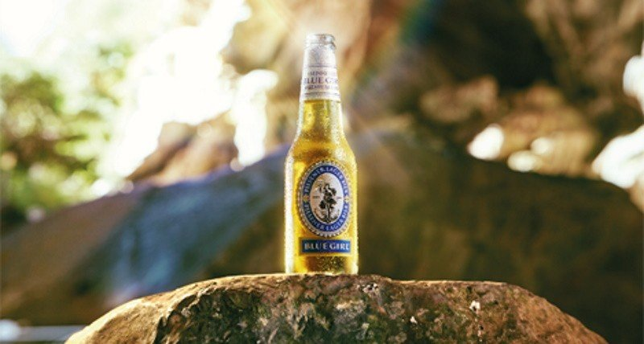
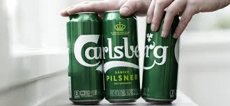
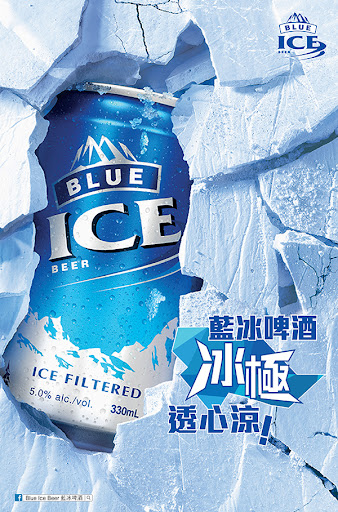
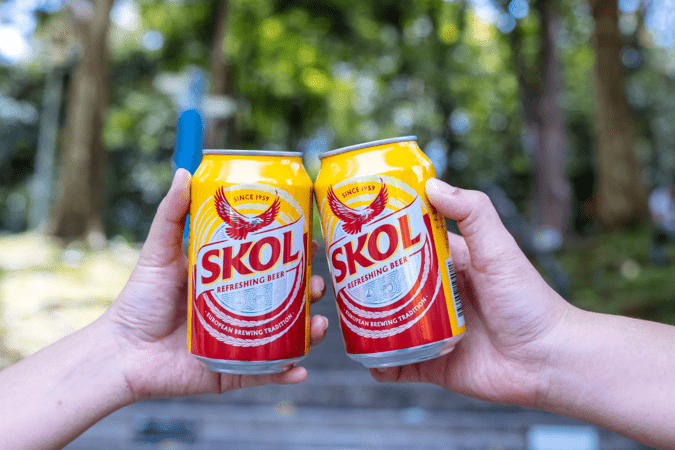
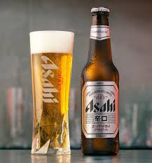

<html>
  <head>
    <meta name="description" content="beer ratings">
  </head>
  <body>
    <h1><u>Rating Light Beer in Hong Kong</u></h1>
    <h2><abbr title="Hypertext Martkup Language">A quick discussion - why beer is so underrated</abbr></h2>
    
      
In this article, 10 beer brands commonly sold in Hong Kong convenience stores will be rated and discussed. Most are traditional brands with wonderful taste and texture, I will recommend certain beers according to your preferences in beverages. The history of beer in Hong Kong dates back to the mid-19th century, the era where beer reached peak popularity in Hong Kong. Yet nowadays, the popularity of beer have been declining, especially among newer generations. Why? Here are a couple of reasons:
      <ul>
        <li>introduction of new types of beverages in the market (e.g. canned cocktails)</li>
        <li>beer lacks wide range of flavours (e.g. Korean soju has 9 flavours)</li>
        <li>increased education enforcement on the cons of alcohol (as a result alcohol, especially the traditional ones, lack popularity among the younger generation... well... <em>until they get to clubs during college</em>)</li>
        <li>presence of motherfuckers of call beer 'bitter'</li>
      </ul>

    
At the end of the day, for whatever reason beer is lacking popularity, beer is still the best light alcohol beverage you would love to have after a long day. It's cheap, good texture, unique flavour, best experience when it comes with a little snack. It is also effective in putting you to sleep without getting you drunk. Moreover, <a href="https://www.intoactionrecovery.com/blog/how-does-alcohol-affect-dopamine/">beer helps boosting the production of endorphins, otherwise known as the feel-good hormones</a>, making you happy as you should always be. Life without beer isn't a fucking life, everyone deserves a beer.

    <h2><abbr title="Hypertext Martkup Language">Top 10 Light Beer in Hong Kong</abbr></h2>
    <ul>
      <li><a href="#bluegirl">Blue Girl :star2: </a></li> 
      <li><a href="#sanmiguel">San Miguel</a></li>
      <li><a href="#tsingtao">Tsingtao</a></li>
      <li><a href="#heineken">Heineken</a></li>
      <li><a href="#carlsberg">Carlsberg</a></li>
      <li><a href="#ice">Ice</a></li>
      <li><a href="#skol">Skol</a></li>
      <li><a href="#corona">Corona :star2: </a></li>
      <li><a href="#asahi">Asahi</a></li>
      <li><a href="#sapporo">Sapporo :star2: </a></li>
    </ul>
     <h3 id="bluegirl"><em>BLUE GIRL</em></h3>
     
    <blockquote> rating: 4.5/5 
      origin: Bremen, Germany (currently brewed in South Korea) 
      year introduced to HK: 1906 
      main ingredients: water, malt, hops, yeast, adjuncts
    </blockquote>
     
Blue girl is one of the most popular brands in Hong Kong. It tastes mildly pleasant with slight bitterness and a hint of floral notes. It comes with a light and smooth, with a crisp finish. Mega-sized Blue Girl bottles are particularly popular and commonly seen in dine-in restaurants in Hong Kong. You can find Blue Girl beer in almost every convenience store and supermarket in Hong Kong. However, it is slightly more pricey compared to other brands, yet still affordable. 

    
<h3 id="sanmiguel"><em>SAN MIGUEL</em></h3>
     
    <blockquote> rating: 3/5 
      origin: Manila, Philippenes (currently brewed in Hong Kong) 
      year introduced to HK: 1948 
      main ingredients: water, malted barley, hops, yeast
    </blockquote>
     
San Miguel is apparently brewed in Hong Kong, it is also the best selling beer in Hong Kong. It comes with a variety of versions, for example San Miguel Pale Pilsen, San Miguel Light, San Miguel Super Dry. San Miguel Pale Pilsen(the standard version) comes with a heavier flavour and rougher texture, while San Miguel Light is lighter version with lower calories, offering a crisp and refreshing taste, highly recommended for beginners. Which tastes better varies among people, for me, I would rate a 2.5/5 for the standard version and a 4/5 for the light version, giving an overall rating of 3/5 for San Miguel considering the other versions as well. Also note that San Miguel beer has a pretty standard pricing.

<h3 id="tsingtao"><em>TSINGTAO</em></h3>
     
     
to be continued <a href="#lazy">(learn more about the creator's laziness)</a>

<h3 id="heineken"><em>HEINEKEN</em></h3>
     
     
to be continued <a href="#lazy">(learn more about the creator's laziness)</a>

<h3 id="carlsberg"><em>CARLSBERG</em></h3>
     
     
to be continued <a href="#lazy">(learn more about the creator's laziness)</a>

<h3 id="ice"><em>ICE</em></h3>
     
     
to be continued <a href="#lazy">(learn more about the creator's laziness)</a>

<h3 id="skol"><em>SKOL</em></h3>
     
     
to be continued <a href="#lazy">(learn more about the creator's laziness)</a>

<h3 id="corona"><em>CORONA</em></h3>
     
    <blockquote> rating: 4.5/5 
      origin: Mexico City, Mexico (currently brewed in China) 
      year introduced to HK: 1981 
      main ingredients: barley malt, corn, hops, yeast, antioxidants (ascorbic acid), propylene glycol alginate
    </blockquote>
     
Corona is a light, smooth, bubbly Mexican beer with an extremely fresh taste. Although it has a lower alcohol content of 4.5% when compared to standard beer (5%), it still gives the most traditional taste of beer. It turns out that there is a huge contrast between canned corona and bottled corona, as bottled coronas are well-known as 'much fresher', it comes with an impressive amount of beer bubbles along opening. Coronas are also often served along with a lime wedge, enhancing its refreshing qualities. Like Asahi, Coronas are most commonly sold in snack stores (e.g. 360 & 759) for a slightly expensive price than usual. 

<h3 id="asahi"><em>ASAHI</em></h3>
     
     
to be continued <a href="#lazy">(learn more about the creator's laziness)</a>

<h3 id="sapporo"><em>SAPPORO</em></h3>
     
     
to be continued <a href="#lazy">(learn more about the creator's laziness)</a>

  <h6 id="lazy">Hi, i just learned coding for like 2 days, can you just stfu and wait for the updates? Here is what i learnt so far:</h6>
  <pre><code> &lt;h1&gt; hello world &lt;h1&gt;
  </body>
</html>
